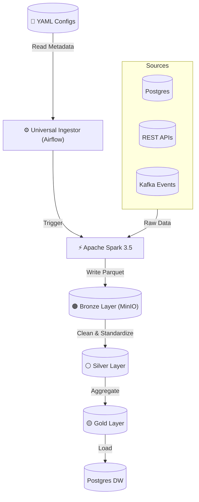

# 🌍 AtlasFlowData (AFD) - Universal Data Platform

> **A Metadata-Driven, Multi-Tenant Data Platform for Modern Analytics.**
> _Built with Airflow 2.10, Spark 3.5, Kafka, and MinIO._

## 🏆 Project Overview

AtlasFlowData is not just a pipeline; it is a **Data Operating System**. Instead of writing custom scripts for every new data source, AFD uses a **Generic Ingestion Engine** that reads YAML configuration files to dynamically generate pipelines.

It currently supports three distinct business domains (Tenants):

1. **Retail (E-Commerce):** Hybrid Batch + Streaming (Kafka) analytics.
2. **Finance (FP&A):** Complex reconciliation of SQL Actuals vs. Excel Budgets.
3. **Tech (DevOps):** API-based DORA metrics (JSON parsing).

## 🏗️ Architecture

**Pattern:** Medallion Architecture (Bronze -> Silver -> Gold)
**Philosophy:** Configuration-over-Code.



## 🛠️ Tech Stack

* **Orchestration**: Apache Airflow 2.10.4 (Python 3.10)
* **Processing**: Apache Spark 3.5.3 (PySpark)
* **Streaming**: Kafka + ZooKeeper
* **Storage**: MinIO (S3 Compatible)
* **Warehouse**: PostgreSQL 13
* **Infrastructure**: Docker Compose

## 🚀 How to Run

1. **Clone the repo:**

```bash

git clone [https://github.com/your-username/AtlasFlowData.git](https://github.com/your-username/AtlasFlowData.git)
cd AtlasFlowData
```

2. **Launch Infrastructure:**

```bash

cd infra
docker-compose --env-file .env up -d --build
```

3. **Access UIs:**

    * **Airflow**: ``http://localhost:8081``

    * **MinIO**: ``http://localhost:9001``

    * **Spark**: ``http://localhost:8080``
