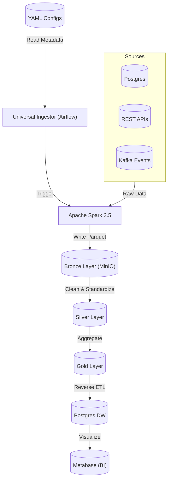

# 🌍 AtlasFlowData (AFD) - Universal Data Platform

> **A Metadata-Driven, Multi-Tenant Data Lakehouse for Modern Analytics.**
> _Built with Airflow 2.10, Spark 3.5, Kafka, MinIO, Postgres, and Metabase._

## Project Overview

AtlasFlowData is not just a pipeline; it is a **Data Operating System**. Instead of writing custom scripts for every new data source, AFD uses a **Generic Ingestion Engine** that reads YAML configuration files to dynamically generate pipelines.

It currently supports three distinct business domains (Tenants):

1. **Retail (E-Commerce):** Hybrid Batch (Orders) + Real-Time Streaming (Kafka Events) analytics.
2. **Finance (FP&A):** Complex reconciliation of SQL Actuals vs. Excel Budgets.
3. **Tech (DevOps):** API-based DORA metrics (JSON parsing).

## Architecture

**Pattern:** Medallion Architecture (Bronze -> Silver -> Gold)  
**Philosophy:** Configuration-over-Code.



## Tech Stack

* **Orchestration**: Apache Airflow 2.10.4 (Python 3.10)
* **Processing**: Apache Spark 3.5.3 (PySpark Structured Streaming)
* **Streaming**: Confluent Kafka + ZooKeeper
* **Storage**: MinIO (S3 Compatible Data Lake)
* **Warehouse**: PostgreSQL 13
* **BI / Analytics**: Metabase
* **Infrastructure**: Docker Compose

## How to Run

> ⚠️ **Note**
> You must create a `.env` file inside the `infra/` directory  
> and also maintain a global `.env` file in the project root.
> Both are required for Docker Compose to work correctly.

### 1. Launch Infrastructure

```bash
git clone [https://github.com/your-username/AtlasFlowData.git](https://github.com/your-username/AtlasFlowData.git)
cd AtlasFlowData/infra
docker-compose --env-file ../.env up -d --build
```

### 2. Start Real-Time Event Streaming

To simulate live website traffic and capture it in the Data Lake, open two terminal tabs and run these processes in the background:

**Terminal 1: Start the Kafka Producer (Fake Website Traffic)**

```bash
docker-compose exec airflow-webserver bash -c "KAFKA_BROKER=kafka:29092 python /opt/airflow/src/streaming/kafka_producer.py"
```

**Terminal 2: Start Spark Structured Streaming (Kafka -> MinIO Bronze)**

```bash
docker-compose exec airflow-webserver bash -c "export MINIO_ROOT_USER=minio_admin && export MINIO_ROOT_PASSWORD=minio_password123 && /home/airflow/.local/bin/spark-submit \
    --master spark://spark-master:7077 \
    --packages org.apache.spark:spark-sql-kafka-0-10_2.12:3.5.3,org.apache.hadoop:hadoop-aws:3.3.4,com.amazonaws:aws-java-sdk-bundle:1.12.262 \
    /opt/airflow/src/streaming/spark_streaming.py"
```

### 3. Process the Data (Silver & Gold Layers)

1. Open **Airflow** (`http://localhost:8081`).
2. Trigger the `process_retail_data` DAG.
3. This Spark batch job will merge the static Postgres data with the live streaming events, aggregate them into Gold metrics (Daily Sales & Product Engagement), and push them back into the Postgres Data Warehouse (Reverse ETL).

### 4. Access UIs

* **Metabase (BI Dashboards)**: `http://localhost:3000`
* **Airflow (Orchestration)**: `http://localhost:8081`
* **MinIO (Data Lake)**: `http://localhost:9001`
* **Spark (Processing)**: `http://localhost:8080`
